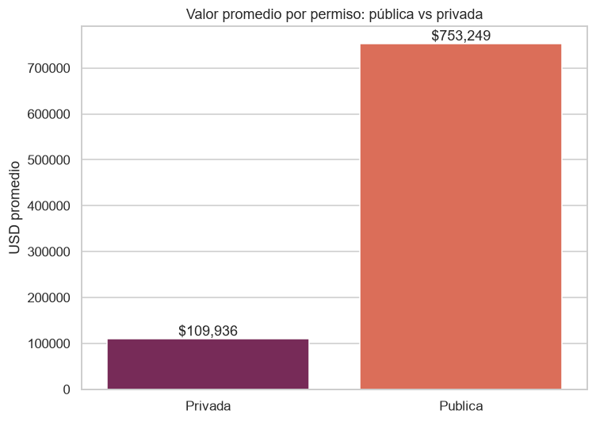

# 🏗️ Análisis de Permisos de Construcción en Ecuador (2011–2014)

> Proyecto de portafolio de **Data Analyst** — análisis end-to-end de datos reales y públicos
> del INEC usando **SQL, Python, Excel y Power BI**.


## 📌 Resumen

Este proyecto analiza **109.552 permisos de construcción reales** emitidos en Ecuador entre 2011
y 2014, con cobertura de las 24 provincias. Parte de microdatos oficiales del INEC (formato
SPSS), los armoniza y limpia, los carga en una base de datos SQLite con esquema estrella, y
responde 8 preguntas de negocio con SQL, un análisis en Python y entregables en Excel y Power BI.

**Fuente de datos:** INEC — Encuesta de Edificaciones (Permisos de Construcción).
Licencia [Creative Commons Attribution 4.0](https://creativecommons.org/licenses/by/4.0/).
Portal público: <https://www.ecuadorencifras.gob.ec/edificaciones-bases-de-datos/>

## 🧰 Habilidades demostradas

- **SQL:** modelado dimensional (esquema estrella), joins, agregaciones, consultas de negocio.
- **Python:** limpieza y armonización de datos con `pandas`, visualización con `matplotlib`/`seaborn`.
- **Preparación de datos:** integración de fuentes con esquemas distintos entre años,
  decodificación de catálogos y normalización de nombres de provincia.
- **Excel:** dashboard con gráficos nativos.
- **Power BI:** dataset modelado y guía de dashboard con medidas DAX.
- **Buenas prácticas:** pipeline reproducible, pruebas automatizadas (`pytest`) y control de versiones.

## 📊 Hallazgos clave

**Concentración geográfica:** Guayas y Pichincha (Guayaquil y Quito) lideran la actividad.


**Menos obras, mayor valor:** el número de permisos baja de 2011 a 2014, pero el valor de
edificación crece hasta un máximo en 2013.


**Obra pública vs privada:** la obra pública es escasa en número (245 permisos) pero su valor
promedio es ~7× el de la privada.



> Ver el análisis completo en [`reports/resumen_ejecutivo.md`](reports/resumen_ejecutivo.md) y el
> [notebook](notebooks/analisis_construccion.ipynb).

## 🗂️ Estructura del repositorio

```
construccion-ecuador-data-analysis/
├── data/                # datos crudos (se descargan) + BD SQLite generada
├── scripts/             # 01 descarga · 02 armonización · 03 BD · 04 Excel · 05 Power BI
├── sql/                 # schema.sql + consultas_negocio.sql (8 preguntas)
├── notebooks/           # análisis en Python con gráficos
├── reports/             # resumen ejecutivo + figuras
├── excel/               # dashboard en Excel
├── powerbi/             # dataset limpio + guía de dashboard
└── tests/               # pruebas automatizadas (pytest)
```

## ▶️ Cómo reproducirlo

```bash
# 1. Instalar dependencias
pip install -r requirements.txt

# 2. Descargar los microdatos del INEC y descomprimir los .zip en data/raw/
python scripts/01_descargar_datos.py

# 3. Ejecutar el pipeline
python scripts/02_armonizar_datos.py     # -> data/processed/permisos_2011_2014.csv
python scripts/03_construir_bd.py         # -> data/construccion.db
python scripts/04_generar_excel.py        # -> excel/dashboard_construccion.xlsx
python scripts/05_exportar_powerbi.py     # -> powerbi/datos_powerbi.csv

# 4. Ejecutar el notebook y las pruebas
jupyter nbconvert --to notebook --execute --inplace notebooks/analisis_construccion.ipynb
pytest
```

## 📝 Nota sobre los datos

Se usan datos **reales y públicos** del INEC para los años **2011–2014** (los que comparten el
conjunto completo de variables de superficie y valor). El año 2010 está disponible pero se
excluyó porque su esquema no incluye esas variables calculadas. Los microdatos crudos no se
versionan en el repositorio; se reconstruyen con `scripts/01_descargar_datos.py`. Ver
[`NOTICE`](NOTICE) para la atribución completa.

## 👤 Autor

**Anthony Guerrero** — Data Analyst
LinkedIn: <https://www.linkedin.com/in/anthony-guerrero-245ab7188>
GitHub: [@Anthonygp21](https://github.com/Anthonygp21)
