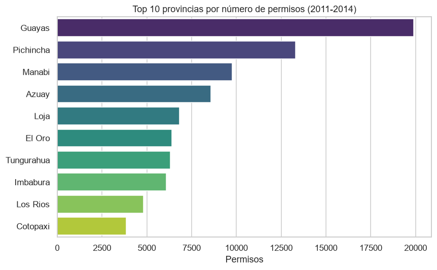
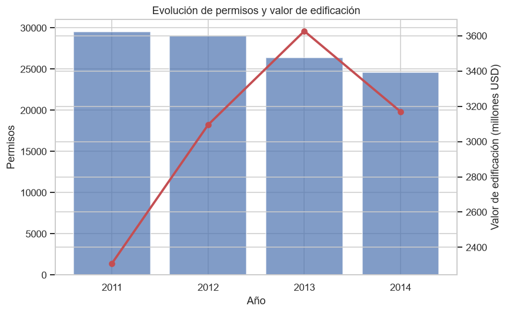
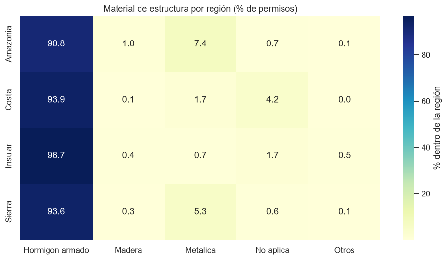

# Resumen Ejecutivo — Permisos de Construcción en Ecuador (2011–2014)

**Fuente:** INEC — Encuesta de Edificaciones (Permisos de Construcción). Licencia CC BY 4.0.
**Alcance:** 109.552 permisos de construcción reales, 24 provincias, años 2011–2014.

## Hallazgos clave

1. **Fuerte concentración geográfica.** Cinco provincias concentran la mayor parte de la
   actividad: Guayas (19.901 permisos), Pichincha (13.311), Manabí (9.769), Azuay (8.571) y
   Loja (6.824). Guayas y Pichincha —que albergan a Guayaquil y Quito— por sí solas explican
   alrededor de un tercio de todos los permisos del país.

   

2. **El número de permisos cae, pero el valor invertido crece hasta 2013.** Entre 2011 y 2014
   los permisos bajaron de 29.550 a 24.573, mientras que el valor de edificación subió de
   ~$2.309 M (2011) a un máximo de ~$3.627 M en 2013, para moderarse en 2014. Es decir, se
   construyen menos obras pero de mayor valor unitario.

   

3. **Hormigón armado domina la construcción.** Es el material de estructura en el 94% de los
   permisos (102.466 de 109.552), seguido muy de lejos por estructura metálica (4.366). El
   patrón se mantiene en todas las regiones (Costa, Sierra, Amazonía, Insular).

   

4. **La obra pública es escasa pero de gran escala.** Solo 245 permisos son de propiedad
   pública frente a 109.307 privados; sin embargo, su valor promedio (~$753.000) es casi 7
   veces el de la obra privada (~$110.000).

5. **Estacionalidad marcada.** La emisión de permisos alcanza su punto máximo hacia mitad de
   año: agosto (11.280), julio (10.434) y septiembre (10.121) son los meses más activos.

6. **Mayor valor por m² en los polos urbanos.** El costo declarado por metro cuadrado es más
   alto en Guayas (~$338/m²), Galápagos (~$337/m²) y Pichincha (~$292/m²).

En conjunto, los permisos autorizaron alrededor de **165.495 viviendas** en el período.

## Metodología y fuente

Los microdatos anuales del INEC (formato SPSS `.sav`) se descargaron, armonizaron —resolviendo
diferencias de esquema y de nomenclatura de provincias entre años— y cargaron en una base
SQLite con esquema estrella. El análisis se realizó con SQL y Python (pandas, matplotlib,
seaborn). Todo el pipeline es reproducible desde `scripts/`.

Datos: **INEC — Encuesta de Edificaciones 2011–2014**, publicados bajo licencia
[Creative Commons Attribution 4.0](https://creativecommons.org/licenses/by/4.0/).
Portal: <https://www.ecuadorencifras.gob.ec/edificaciones-bases-de-datos/>
